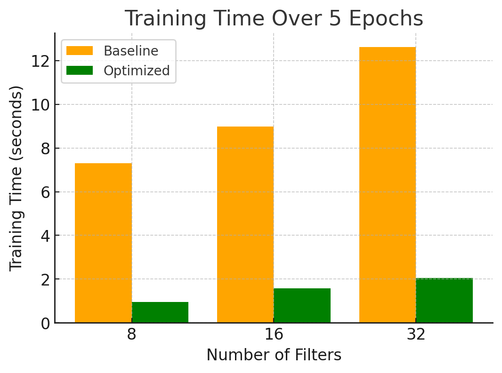

# CNN CUDA-Optimization Project

## Description

This project presents an end-to-end implementation of a convolutional neural network (CNN) built entirely from scratch using CUDA. Two versions of the CNN are provided: a baseline implementation (cnn_baseline.cu) and an optimized version (cnn_optimized.cu) that applies a range of CUDA optimization techniques. Both the forward and backward passes are fully parallelized on the GPU without relying on any external deep learning libraries. We do not rely on any deep learning or CUDA libraries (e.g., cuBLAS, cuDNN, etc.).

The network architecture comprises:
- A convolutional layer followed by a ReLU activation,
- A max pooling layer,
- A flatten operation,
- A fully-connected layer, and
- A softmax layer combined with cross-entropy loss.
- Stochastic Gradient Descent (SGD) to update parameters.


Both the forward and backward passes are fully parallelized on the GPU. The network is trained on the MNIST dataset, and the trained model is subsequently evaluated on the MNIST test set to verify correctness. In addition to measuring model accuracy for validation, training time is recorded to compare the performance improvements achieved through CUDA optimizations.


## Optimizations

The baseline version is implemented in a straightforward, naive manner. Although it fully parallelizes both the forward and backward passes on the GPU, it does not employ any advanced optimization techniques. In contrast, the optimized version incorporates several enhancements to improve performance.

Optimizations employed in the optimized version include:

- Overlapping host-device transfers with computation via CUDA streams  
- Kernel fusion to combine sequential operations  
- Shared memory usage for improved data reuse  
- Matrix tiling to enhance memory coalescing  
- Loop unrolling to reduce loop overhead  
- Warp-level primitives for efficient intra-warp operations  
- Fast CUDA intrinsics for optimized mathematical computations  
- Constant memory usage for small, frequently accessed data  

The figure below illustrates that these optimizations result in an average 7× improvement in training performance compared to the baseline implementation while maintaining model accuracy:




## Setup

- NVIDIA RTX A5000 GPU with 24GB of on-board memory  
- CUDA 12.6


## Build Instructions

1. **Download the MNIST Data:**
   - Run the provided Python script `download_mnist.py` to download and extract the MNIST dataset.
   - Upon successful execution, the following files should be present in the working directory:
     - `train-images.idx3-ubyte`
     - `train-labels.idx1-ubyte`
     - `t10k-images.idx3-ubyte`
     - `t10k-labels.idx1-ubyte`

2. **Build the Project:**
   - By default, the Makefile is configured to compile the optimized version (`cnn_optimized.cu`).
   - In the project directory, run:
     ```
     make
     ```
   - To build the baseline version instead, modify the Makefile to use `cnn_baseline.cu` in place of `cnn_optimized.cu`, then run `make` again.

3. **Run the Executable:**
   - After the build completes, run the generated executable (named `cnn_optimized` or alternatively `cnn_baseline`) by executing:
     ```
     ./cnn_optimized or
     ./cnn_baseline
     ```

